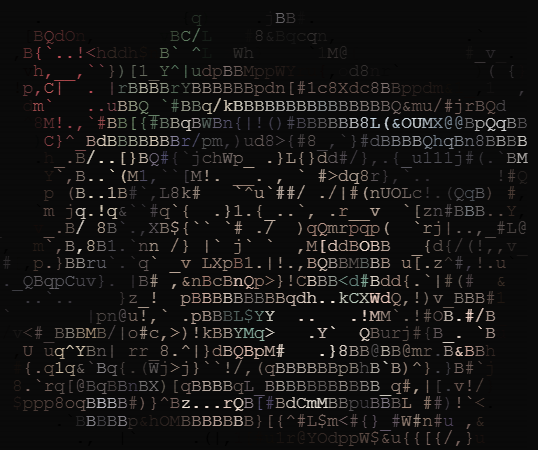

<!-- markdownlint-disable MD033 MD041 MD024 -->
<p align="center">
  
</p>

<div align="center">

# maafw-cli


[](https://github.com/MaaXYZ/MaaFramework)
[](https://pypi.org/project/maafw-cli/)

[MaaFramework](https://github.com/MaaXYZ/MaaFramework) 命令行界面。让人、AI、脚本直接通过命令形式操作 Android / Win32 设备。

**注意：该项目是一个实验性项目，目前正处于早期开发阶段。接口和功能可能随开发进程随时变化，如有造成不便敬请谅解。**

</div>

## MaaFW CLI vs [MaaMCP](https://github.com/MAA-AI/MaaMCP)

**CLI**：现代 coding agent 更适合通过 CLI + skill 的方式驱动设备自动化。相比 MCP，CLI 调用通常只需要一条简洁命令，不必把庞大的工具 schema、持续会话状态或额外协议开销带进模型上下文，因此更省 token，也更容易和代码库分析、测试、脚本、定时任务组合。对于需要高频执行"识别 → 操作 → 校验"的 agent，`maafw-cli` 往往是更直接的选择。

**MCP**：MCP 仍然适合需要持久连接的场景。如果你需要维持持续会话，进行探索性的自动化，自修复测试，动态维护pipeline节点图等，或许使用具有持久状态的MCP是更好地选择。你可以了解更多有关 [MaaMCP](https://github.com/MAA-AI/MaaMCP) 的信息。

## 特性

- **后台守护进程** — 后台 daemon 持有 Controller 连接以降低操作延迟
- **Element 引用** — OCR / reco 结果赋予 e1, e2, e3…，后续命令直接 `click e3`
- **多种感知方式** — OCR、模板匹配、特征匹配、颜色匹配，统一通过 `reco` 命令暴露
- **自动截图** — `ocr` 和 `reco` 自动保存截图，结果包含截图路径
- **多会话** — 支持多个设备同时连接，通过`--on phone` 指定操作目标
- **`--json` 输出** — 严格 JSON，方便脚本解析
- **TTY 自动检测** — 终端用户自动彩色输出，AI / 管道 / 脚本自动纯文本

## 安装

```bash
# 直接运行
uvx maafw-cli

# 或从源码
git clone https://github.com/otowa-kotori/maafw-cli.git
cd maafw-cli
uv sync
```

首次使用需要下载 OCR 模型：

```bash
maafw-cli resource download-ocr
```

## 30 秒上手

```bash
# 连接设备（自动启动后台 daemon）
maafw-cli connect adb 127.0.0.1:16384
maafw-cli --on notepad connect win32 "记事本"

# OCR — 识别屏幕文字，输出 e1, e2, e3...（自动保存截图）
maafw-cli ocr

# 原生感知 — 模板匹配、颜色匹配等
maafw-cli reco TemplateMatch template=button.png threshold=0.8
maafw-cli reco ColorMatch lower=200,0,0 upper=255,50,50

# 点击 — 用 Element 引用或坐标
maafw-cli click e3
maafw-cli click 452,387

# 更多操作
maafw-cli swipe 100,800 100,200
maafw-cli type "hello world"
maafw-cli key enter
maafw-cli action longpress e1
maafw-cli action shell "ls /sdcard"
maafw-cli screenshot
```

## 命令速览

| 命令 | 说明 |
|------|------|
| `device [adb\|win32\|all] [FILTER]` | 列出可用设备（可按名字过滤） |
| `connect adb <DEVICE>` | 连接 ADB 设备 |
| `connect win32 <WINDOW>` | 连接 Win32 窗口 |
| `ocr [--roi x,y,w,h] [--text-only]` | 屏幕 OCR（自动保存截图） |
| `reco <TYPE> [params...] [--raw JSON]` | 原生感知（TemplateMatch / FeatureMatch / ColorMatch / OCR） |
| `screenshot [-o FILE]` | 截图（默认保存到当前目录） |
| `click <TARGET>` | 点击（e3 或 452,387） |
| `swipe <FROM> <TO> [--duration MS]` | 滑动 |
| `scroll <DX> <DY>` | 滚动（仅 Win32） |
| `type <TEXT>` | 输入文本 |
| `key <KEYCODE>` | 按键（enter / back / f5 / 0x0D） |
| `action longpress <TARGET>` | 长按 |
| `action startapp / stopapp <INTENT>` | 启动 / 停止应用（ADB） |
| `action shell <CMD>` | 设备 shell 命令 |
| `action touch-down / touch-move / touch-up` | 低级触控 API |
| `action key-down / key-up <KEYCODE>` | 按键按下 / 松开 |
| `action mousemove <DX> <DY>` | 鼠标相对移动（仅 Win32） |
| `resource download-ocr [--mirror] / status / load-image` | 管理资源（OCR 模型、图片模板） |
| `pipeline load / list / show / validate / run` | Pipeline 自动化 |
| `session list / default / close / close-all` | 管理命名会话 |
| `daemon start / stop / restart / status` | 管理后台 daemon |
| `completion [bash\|zsh\|fish]` | 生成 shell 补全脚本 |
| `repl [--local]` | 交互式 REPL |

## 全局选项

| 选项 | 说明 |
|------|------|
| `--json` | 输出严格 JSON |
| `--quiet` | 抑制非错误输出 |
| `-v` | 显示耗时和调试信息 |
| `--on SESSION` | 指定目标会话（也可通过 `MAAFW_SESSION` 环境变量设置） |
| `--color` / `--no-color` | 强制开启/关闭彩色（默认自动：终端有色，管道无色） |

全局选项可以放在命令前后任意位置：`maafw-cli ocr --on game` 等价于 `maafw-cli --on game ocr`。

## Daemon 模式

默认所有命令通过后台 daemon 执行，Controller 连接持久保持：

```bash
maafw-cli --on phone connect adb 127.0.0.1:16384    # 创建命名会话
maafw-cli --on notepad connect win32 "记事本"         # 第二个设备
maafw-cli --on phone ocr                              # 操作指定设备
maafw-cli session list                                # 查看会话
maafw-cli daemon status                               # 查看 daemon 状态
```

## 给 AI / 脚本用

```bash
# JSON 输出，方便脚本解析
maafw-cli --json ocr | jq '.results[] | .ref + " " + .text'

# 模板匹配 + JSON
maafw-cli resource load-image ./templates/
maafw-cli --json reco TemplateMatch template=button.png threshold=0.8

# 操作链：感知 → 操作 → 感知验证
maafw-cli ocr
maafw-cli click e3
maafw-cli ocr
```

## 文档

- [命令参考](doc/USAGE.md)
- [工程结构](doc/ARCHITECTURE.md)
- [设计规格](doc/SPEC.md)
